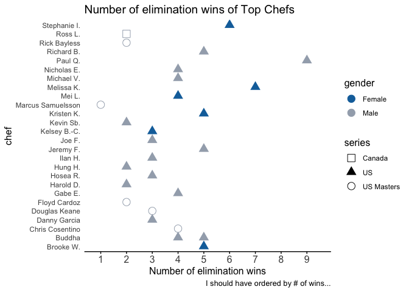
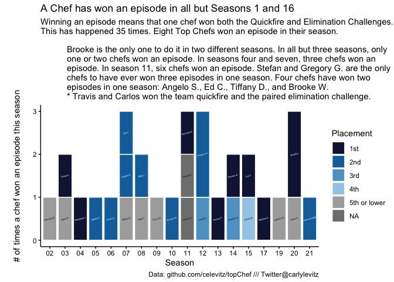
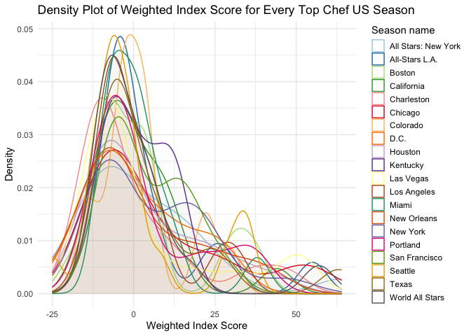
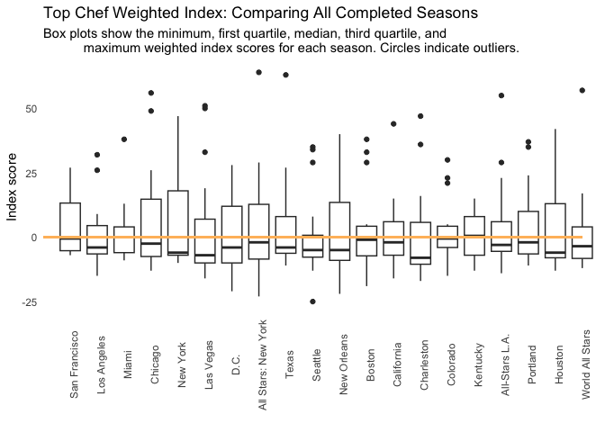
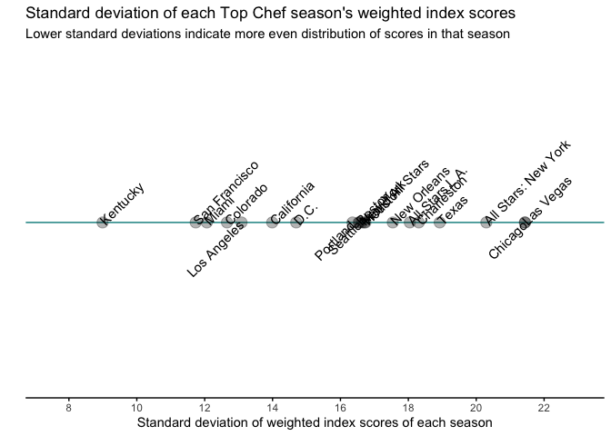
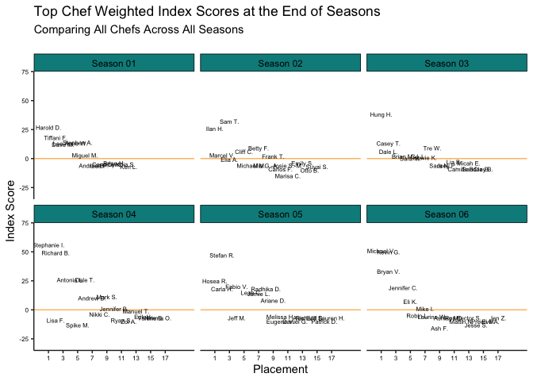
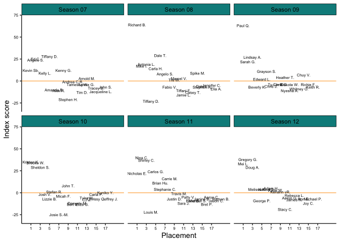
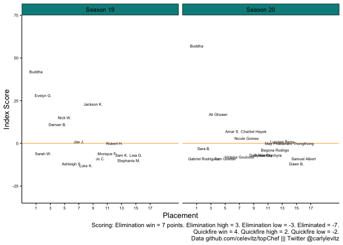

topChef
================

## 1. Introduction to topChef

topChef is a collection of data sets detailing events across all seasons
of Top Chef US and Top Chef Masters US and one season of Top Chef
Canada. It includes Chef information, challenge descriptions, challenge
winners, episode information, guest judge names, and reward/prize
information.

### In the works:

- Adding or updating description data for challenges
- Adding in dish for every chef in every challenge
- Confessional counts

### Difference between version 0.1.0 and upcoming 0.2.0:

- Edits to ‘chefdetails’: added occupation category and added data for
  season 21
- Edits to ‘challengedescriptions’: added data for season 21. Updated
  historical data if it was missing, particularly for seasons 1-3
- Edits to ‘challengewins’: added data for season 21. Updated historical
  data, particularly the quickfire challenges to have low/high data. So
  far, the edits have only been for seasons 1-3
- Edits to ‘judges’: added data for season 21 and added variables for
  gender and whether the judge was a person of color.
- Edits to ‘rewards’: added data for season 21, and added a variable for
  categorizing reward types.
- Edits to ‘episodeinfo’: added data for season 21
- Made tests more rigorous
- Edits to index function: 1) simplified it to not use tidy, and instead
  pull in from dplyr; 2) fixed an error that was making the index pull
  in data for all challenges prior to a specific number of challenges
  instead of pulling in JUST the specific number of each type of
  challenge; 3) updated description to say that you cannot have 0 as an
  input; 4) fix an error that was leading to people getting an incorrect
  amount of points in episodes where there was an elimination challenge
  AND a (sudden death quickfire challenge OR a quickfire elimination).

## 2. Installation

``` r
install.packages("topChef")
```

I am continually improving the datasets, so github version is likely to
be more up-to-date. If it’s not appearing to be updated, restart your R
sessions, install it again, and call it into your library.

``` r
devtools::install_github("celevitz/topChef")
```

## 3. Acknowledgments and Inspiration

Data were collected manually while watching each season of Top Chef.
Additional data were collected from
<https://en.wikipedia.org/wiki/Top_Chef>. My Top Chef data journey was
inspired by <https://topchefstats.com/>.

Huge thanks to <https://github.com/doehm> for all his support!

## 4. Overview of datasets

Across datasets, key joining variables include:

- `chef`
- `season`
- `seasonNumber`
- `series`
- `episode`

### 4.a. Datasets

#### 4.a.i. Chef details

A tibble containing information about Chefs for each season they are in,
including placement and gender. For some but not all seasons, there is
also information on hometown, current city of residence, age, a flag for
whether they are a person of color, and their occupation.

``` r
chefdetails 
#> # A tibble: 432 × 14
#>    name    chef  hometown city  state   age season seasonNumber series placement
#>    <chr>   <chr> <chr>    <chr> <chr> <dbl> <chr>         <dbl> <chr>      <dbl>
#>  1 Ross L… Ross… <NA>     St. … Newf…    31 Canad…            6 Canada         1
#>  2 Mark S… Mark… <NA>     Vanc… Brit…    29 Canad…            6 Canada         2
#>  3 Jinhee… Jinh… <NA>     Calg… Albe…    38 Canad…            6 Canada         3
#>  4 JP Mir… JP M. <NA>     Mont… Queb…    30 Canad…            6 Canada         3
#>  5 Nathan… Nath… <NA>     Sask… Sask…    35 Canad…            6 Canada         5
#>  6 Darren… Darr… <NA>     Mont… Queb…    27 Canad…            6 Canada         6
#>  7 Jesse … Jess… <NA>     Sask… Sask…    29 Canad…            6 Canada         7
#>  8 Matt S… Matt… <NA>     Toro… Onta…    34 Canad…            6 Canada         7
#>  9 Elia H… Elia… <NA>     Toro… Onta…    37 Canad…            6 Canada         9
#> 10 Ivana … Ivan… <NA>     Toro… Onta…    33 Canad…            6 Canada        10
#> # ℹ 422 more rows
#> # ℹ 4 more variables: personOfColor <chr>, occupation <chr>, gender <chr>,
#> #   occupation_category <chr>
```

#### 4.a.ii. Challenge descriptions

A tibble containing information about each challenge that the Chefs
compete in.

``` r
challengedescriptions 
#> # A tibble: 666 × 17
#>    season   seasonNumber series episode challengeType outcomeType
#>    <chr>           <dbl> <chr>    <dbl> <chr>         <chr>      
#>  1 Kentucky           16 US           1 Quickfire     Team       
#>  2 Kentucky           16 US           1 Elimination   Team       
#>  3 Kentucky           16 US           2 Quickfire     Individual 
#>  4 Kentucky           16 US           2 Elimination   Team       
#>  5 Kentucky           16 US           3 Quickfire     Individual 
#>  6 Kentucky           16 US           3 Elimination   Individual 
#>  7 Kentucky           16 US           4 Quickfire     Individual 
#>  8 Kentucky           16 US           4 Elimination   Team       
#>  9 Kentucky           16 US           5 Elimination   Team       
#> 10 Kentucky           16 US           6 Elimination   Individual 
#> # ℹ 656 more rows
#> # ℹ 11 more variables: challengeDescription <chr>, shopTime <chr>,
#> #   shopBudget <chr>, prepTime <dbl>, cookTime <dbl>, productPlacement <chr>,
#> #   advantage <chr>, lastChanceKitchenWinnerEnters <chr>,
#> #   restaurantWarWinner <chr>, restaurantWarEliminated <chr>,
#> #   didJudgesVisitWinningTeamFirst <chr>
```

#### 4.a.iii. Challenge wins

A tibble containing win and loss data for each chef in each episode.

``` r
challengewins
#> # A tibble: 10,053 × 10
#>    season   seasonNumber series episode inCompetition immune chef  challengeType
#>    <chr>           <dbl> <chr>    <dbl> <lgl>         <lgl>  <chr> <chr>        
#>  1 All Sta…            8 US           1 TRUE          FALSE  Ange… Quickfire    
#>  2 All Sta…            8 US           1 TRUE          FALSE  Anto… Quickfire    
#>  3 All Sta…            8 US           1 TRUE          FALSE  Carl… Quickfire    
#>  4 All Sta…            8 US           1 TRUE          FALSE  Case… Quickfire    
#>  5 All Sta…            8 US           1 TRUE          FALSE  Dale… Quickfire    
#>  6 All Sta…            8 US           1 TRUE          FALSE  Dale… Quickfire    
#>  7 All Sta…            8 US           1 TRUE          FALSE  Elia… Quickfire    
#>  8 All Sta…            8 US           1 TRUE          FALSE  Fabi… Quickfire    
#>  9 All Sta…            8 US           1 TRUE          FALSE  Jami… Quickfire    
#> 10 All Sta…            8 US           1 TRUE          FALSE  Jenn… Quickfire    
#> # ℹ 10,043 more rows
#> # ℹ 2 more variables: outcome <chr>, rating <dbl>
```

#### 4.a.iv. Judges

A tibble containing information about who were the guest judges for each
challenge.

``` r
judges 
#> # A tibble: 784 × 11
#>    season   seasonNumber series episode challengeType outcomeType guestJudge    
#>    <chr>           <dbl> <chr>    <dbl> <chr>         <chr>       <chr>         
#>  1 Canada 6            6 Canada       2 Quickfire     Individual  Danny Bowien  
#>  2 Canada 6            6 Canada       2 Elimination   Individual  Lynn Crawford 
#>  3 Canada 6            6 Canada       3 Quickfire     Individual  Peter Meehan  
#>  4 Canada 6            6 Canada       3 Elimination   Individual  Carlos Gaytan 
#>  5 Canada 6            6 Canada       4 Quickfire     Individual  Mark McEwan   
#>  6 Canada 6            6 Canada       4 Quickfire     Individual  Rob Gentile   
#>  7 Canada 6            6 Canada       4 Elimination   Team        Ruth Reichl   
#>  8 Canada 6            6 Canada       5 Quickfire     Individual  Brandon Olsen 
#>  9 Canada 6            6 Canada       5 Elimination   Team        Alexandra Fes…
#> 10 Canada 6            6 Canada       6 Quickfire     Individual  Nicole Gomes  
#> # ℹ 774 more rows
#> # ℹ 4 more variables: gender <chr>, personOfColor <chr>, competedOnTC <chr>,
#> #   otherShows <chr>
```

#### 4.a.v. Rewards

A tibble containing information about rewards and prizes won by
challenge.

``` r
rewards
#> # A tibble: 345 × 9
#>    season       seasonNumber series episode challengeType outcomeType rewardType
#>    <chr>               <dbl> <chr>    <dbl> <chr>         <chr>       <chr>     
#>  1 All Stars: …            8 US           1 Elimination   Individual  Money     
#>  2 All Stars: …            8 US           3 Quickfire     Team        Money     
#>  3 All Stars: …            8 US           3 Quickfire     Team        Money     
#>  4 All Stars: …            8 US           3 Quickfire     Team        Money     
#>  5 All Stars: …            8 US           3 Quickfire     Team        Money     
#>  6 All Stars: …            8 US           3 Elimination   Team        Prize     
#>  7 All Stars: …            8 US           4 Quickfire     Individual  Money     
#>  8 All Stars: …            8 US           4 Elimination   Team        Prize     
#>  9 All Stars: …            8 US           5 Quickfire     Individual  Prize     
#> 10 All Stars: …            8 US           6 Elimination   Team        Prize     
#> # ℹ 335 more rows
#> # ℹ 2 more variables: reward <chr>, chef <chr>
```

#### 4.a.vi. Episode info

A tibble containing information about each episode.

``` r
episodeinfo 
#> # A tibble: 372 × 8
#>    season        seasonNumber series overallEpisodeNumber episode episodeName   
#>    <chr>                <dbl> <chr>                 <dbl>   <dbl> <chr>         
#>  1 Canada 6                 6 Canada                   60       1 The Next Wave 
#>  2 Canada 6                 6 Canada                   61       2 The Chicken o…
#>  3 Canada 6                 6 Canada                   62       3 Que Rico      
#>  4 Canada 6                 6 Canada                   63       4 Restaurant Wa…
#>  5 Canada 6                 6 Canada                   64       5 Double Overti…
#>  6 Canada 6                 6 Canada                   65       6 That's a Lot …
#>  7 Canada 6                 6 Canada                   66       7 Wine of the T…
#>  8 Canada 6                 6 Canada                   67       8 Finale Four W…
#>  9 San Francisco            1 US                        1       1 Who Deserves …
#> 10 San Francisco            1 US                        2       2 Food of Love  
#> # ℹ 362 more rows
#> # ℹ 2 more variables: airDate <date>, nCompetitors <dbl>
```

### 4.b. Example using multiple datasets: How many elimination challenge wins did Top Chef winners have?

##### 4.b.i. Visualization

<!-- -->

##### 4.b.ii. Code

``` r
library(ggplot2)

chefdetails %>% 
  # Keep just winners and relevant variables (just the winning chef's name)
  filter(placement == 1) %>%
  select(chef, gender,series,season) %>%
  # Bring on the challenge result data
  left_join(challengewins) %>%
  # Keep just elimination & sudden death quickfire challenges
  filter(challengeType %in% c("Elimination","Quickfire Elimination"
                              ,"Sudden Death Quickfire")) %>%
  # Get the number of wins for each person
  group_by(series,season,seasonNumber,chef,gender) %>%
  filter(outcome %in% c("WIN","WINNER")) %>%
  summarise(wins=n()) %>%
  # Plot
  ggplot(aes(x=wins,y=chef,color=gender,fill=gender,shape=series)) +
    geom_point(size=4) +
    theme_minimal() + 
    # beautification
    scale_color_manual(values=c("#1170AA", "#A3ACB9")) +
    scale_shape_manual(values=c(0,17,1)) +
    scale_x_continuous(name="Number of elimination wins", 
                         breaks=seq(1,9,1),
                         limits=c(.8,9.5),
                         labels=seq(1,9,1)) +
    theme(panel.grid = element_blank(),
            title=element_text(size=12),
            axis.line.x=element_line(color="black"),
            axis.ticks.x=element_line(color="black"),
            axis.text.x=element_text(size=12),
            axis.title.x=element_text(size=12)) +
  labs(title="Number of elimination wins of Top Chefs"
       ,caption="I should have ordered by # of wins...")
    
```

### 4.c. Example using multiple datasets: winning an episode

#### 4.c.i. Visualization

<!-- -->

#### 4.c.ii. Code

``` r
library(ggplot2)
library(topChef)
## Won the episode
    # Data set up
      # how many episodes each chef won in each season
          wonepi <- challengewins %>% select(!rating) %>%
                    mutate(challengeType=case_when(challengeType %in% c("Quickfire Elimination","Sudden Death Quickfire") ~ "Quickfire"
                                                    ,TRUE ~ challengeType)) %>%
                    filter(outcome %in% c("WIN","WINNER") & challengeType %in% c("Elimination","Quickfire")) %>%
                    distinct() %>%
                    pivot_wider(names_from=challengeType,values_from=outcome) %>%
                    filter(Quickfire == "WIN" & (Elimination %in% c("WIN","WINNER"))) %>%
                    # were there multiple winners
                      group_by(series,season,seasonNumber, episode) %>%
                      mutate(nchefs=n()
                             ,chef=ifelse(nchefs > 1,paste0(chef,"*"),chef)) %>%
                    # how many times did each chef win an episode?
                    ungroup() %>% group_by(series,season,seasonNumber,chef) %>%
                    summarise(n=n()) %>%
                    select(series,season,seasonNumber,chef,n) %>%
                    distinct() %>%
                    mutate(seasonNumberchar=case_when(seasonNumber <= 9 ~paste0("0",as.character(seasonNumber))
                                                   ,TRUE ~as.character(seasonNumber)) ) %>%
                    filter(series == "US") 
          
    # visualize
          wonepivizdata <- wonepi %>%
            # add on placement of chefs, just for those who have won an episode
            left_join(topChef::chefdetails %>% select(season,seasonNumber,chef,placement)) %>%
            mutate(placement=as.character(case_when(placement > 5 ~ 5
                                                    ,TRUE ~ placement)) 
                   ,placement = case_when(placement == "5" ~ "5th or lower"
                                          ,placement == "1" ~ "1st"
                                          ,placement == "2" ~ "2nd"
                                          ,placement == "3" ~ "3rd"
                                          ,placement == "4" ~ "4th"
                                          ,TRUE ~ placement))
          
          wonepivizdata <- wonepivizdata[order(wonepivizdata$seasonNumberchar,wonepivizdata$n,wonepivizdata$chef),]

    ## Visualization
          wonepivizdata %>%
            ggplot(aes(x=seasonNumberchar,y=n,label=chef,fill=factor(placement))) +
            scale_fill_manual(values=c("#141B41","#1170AA","#5fa2ce","#a3cce9","#ababab")) +
            geom_col(position="stack",color="white") +
            geom_text(size = 1, position = position_stack(vjust=.5),angle=15
                      ,color=case_when(wonepivizdata$placement == "1st"~ "white"
                                       ,wonepivizdata$placement == "2nd" ~ "white"
                                       ,TRUE ~ "black"
                                       ,is.na(wonepivizdata$placement) ~ "black")) +
            labs(title="A Chef has won an episode in all but Seasons 1 and 16"
                 ,subtitle="Winning an episode means that one chef won both the Quickfire and Elimination Challenges.\nThis has happened 35 times. Eight Top Chefs won an episode in their season.\n
           Brooke is the only one to do it in two different seasons. In all but three seasons, only 
           one or two chefs won an episode. In seasons four and seven, three chefs won an 
           episode. In season 11, six chefs won an episode. Stefan and Gregory G. are the only 
           chefs to have ever won three episodes in one season. Four chefs have won two 
           episodes in one season: Angelo S., Ed C., Tiffany D., and Brooke W. 
           * Travis and Carlos won the team quickfire and the paired elimination challenge."
                 ,caption= "Data: github.com/celevitz/topChef /// Twitter@carlylevitz") +
            ylab("\n# of times a chef won an episode this season\n") +
            xlab("Season") +
            theme_minimal() +
            theme(panel.grid = element_blank()
                  ,axis.line.x=element_line(color="black")
                  ,axis.ticks.x=element_line(color="black")
                  ,axis.line.y=element_line(color="black")
                  ,axis.ticks.y=element_line(color="black")
                  ,axis.text.x=element_text(color="black")
                  ,axis.text.y=element_text(color="black")
                  ,axis.title.x = element_text(color="black")
                  ,axis.title.y = element_text(color="black") ) +
            guides(fill = guide_legend(title = "Placement"))
          
```

## 5. Weighted Index Function

I created a weighted index to compare chefs within and across seasons. I
am still working on it, but this is how things currently stand: The
weighted index is calculated by assigning a certain number of points to
different outcomes. For the sake of simplicity, Sudden Death Quickfires
and Quickfire Elimination Challenges are counted as Elimination
Challenges. The scoring is as follows:

- Elimination win = 7 points
- Elimination high = 3 points
- Elimination low = -3 points
- Eliminated = -7 points
- Quickfire win = 4 points
- Quickfire high = 2 points
- Quickfire low = -2 points

The `weightedindex` function takes the following parameters:

- `series`: US, US Masters, or Canada
- `seasonnumber`: Values between 1 and 20 for Top Chef US; 1 through 5
  for US Masters; and 6 for Canada
- `numberofelimchalls`: Number of elimination challenges through which
  you want to calculate the index. Values between 1 and 20.
- `numberofquickfires`: Number of quickfire challenges through which you
  want to calculate the index. Values between 1 and 20.

Currently, the function will include more Quickfire challenges than you
have specified in the function. It will keep the episodes in each season
through the episode with the Nth Elimination Challenge or the Nth
Quickfire, whichever is the higher episode. This was a way to hold
constant the number of challenges that have occurred so that chefs could
be more comparable across seasons.

The `weightedindex` function exports a tibble with the variables of:
series, season name, season number, chef, chef’s placement, number of
elimination challenges wins/highs/lows/outs, number of quickfire
challenge wins/highs/lows, and the weighted index score.

### 5.a. Distribution of Weighted Index Scores at the Completion of All Seasons

<!-- --><!-- --><!-- -->

### 5.b. Examples that use the `weightedindex` function: full seasons

##### 5.b.i. Visualizations

<!-- --><!-- --><!-- --><!-- -->

##### 5.b.ii. Code

``` r

library(topChef)
library(ggplot2)
library(tidyr)
library(dplyr)
 ## Get the index for all seasons
    
    allseasons <- weightedindex("US",1,20,20)
    for (season in seq(2,20,1)) {
      allseasons <- rbind(allseasons,weightedindex("US",season,20,20))
      
    }
    
  ## Graph it
    # for sorting reasons, have the season be a character
    allseasons$seasonnumchar[allseasons$seasonNumber <= 9] <- 
      paste0("0",as.character(allseasons$seasonNumber[allseasons$seasonNumber <= 9]))
    allseasons$seasonnumchar[allseasons$seasonNumber > 9] <- 
      as.character(allseasons$seasonNumber[allseasons$seasonNumber > 9])
    
    # for sorting reasons, have the placement as a character
    allseasons$placementchar[allseasons$placement <= 9] <- 
      paste0("0",as.character(allseasons$placement[allseasons$placement <= 9]))
    allseasons$placementchar[allseasons$placement > 9] <- 
      as.character(allseasons$placement[allseasons$placement > 9])
    
  # Distribution of scores at the end of the competition/seasons
    graphalltitles <- function(dataset) {
      dataset %>%
      ggplot(aes(x=placement,y=indexWeight,label=chef)) +
        facet_wrap(~paste0("Season ",seasonnumchar)) +
        geom_hline(yintercept=0,color="#ffbc69")+
        geom_text(hjust=0.5,size=2) +
      theme_minimal() +
      labs(title=paste0("Top Chef Weighted Index Scores at the End of Seasons")
           ,subtitle="Comparing All Chefs Across All Seasons\n")+
      ylab("Index Score") + xlab("Placement") +
      scale_y_continuous(lim=c(-30,70)) +
      scale_x_continuous(lim=c(0,20),breaks=seq(1,18,2),labels = seq(1,18,2)) +
      theme(panel.grid = element_blank() 
            ,axis.text.x=element_text(size=6,color="black")
            ,axis.text.y=element_text(size=6,color="black")
            ,axis.ticks=element_line(color="gray15") 
            ,axis.line=element_line(color="gray15") 
            ,strip.background=element_rect(fill="darkcyan")
            ,strip.text=element_text(color="black"))
    }
    
    graphnotitlenocaption <- function(dataset) {
      dataset %>%
      ggplot(aes(x=placement,y=indexWeight,label=chef)) +
        facet_wrap(~paste0("Season ",seasonnumchar)) +
        geom_hline(yintercept=0,color="#ffbc69")+
        geom_text(hjust=0.5,size=2) +
      theme_minimal() +
      ylab("Index score") + xlab("Placement") +
      scale_y_continuous(lim=c(-30,70)) +
      scale_x_continuous(lim=c(0,20),breaks=seq(1,18,2),labels = seq(1,18,2)) +
      theme(panel.grid = element_blank() 
            ,axis.text.x=element_text(size=6,color="black")
            ,axis.text.y=element_text(size=6,color="black")
            ,axis.ticks=element_line(color="gray15") 
            ,axis.line=element_line(color="gray15")
            ,strip.background=element_rect(fill="darkcyan")
            ,strip.text=element_text(color="black"))
    }
    graphonlycaption <- function(dataset) {
      dataset %>%
      ggplot(aes(x=placement,y=indexWeight,label=chef)) +
        facet_wrap(~paste0("Season ",seasonnumchar)) +
        geom_hline(yintercept=0,color="#ffbc69")+
        geom_text(hjust=0.5,size=2) +
        theme_minimal() +
        ylab("Index Score") + xlab("Placement") +
        scale_y_continuous(lim=c(-30,70)) +
        scale_x_continuous(lim=c(0,20),breaks=seq(1,18,2),labels = seq(1,18,2)) +
        theme(panel.grid = element_blank() 
              ,axis.text.x=element_text(size=6,color="black")
              ,axis.text.y=element_text(size=6,color="black")
              ,axis.ticks=element_line(color="gray15") 
              ,axis.line=element_line(color="gray15")
              ,strip.background=element_rect(fill="darkcyan")
              ,strip.text=element_text(color="black")) +
        labs(caption="Scoring: Elimination win = 7 points. Elimination high = 3. Elimination low = -3. Eliminated = -7.\nQuickfire win = 4. Quickfire high = 2. Quickfire low = -2.\nData github.com/celevitz/topChef ||| Twitter @carlylevitz")
    }
    
    graphalltitles(allseasons %>%
      filter(seasonNumber %in% c(1,2,3,4,5,6)) ) 
    graphnotitlenocaption(allseasons %>%
      filter(seasonNumber %in% c(7,8,9,10,11,12)) ) 
    graphnotitlenocaption(allseasons %>%
      filter(seasonNumber %in% c(13,14,15,16,17,18)) )      
    graphonlycaption(allseasons %>%
      filter(seasonNumber %in% c(19,20)) ) 
    
    
```

### 5.c. Examples that use the `weightedindex` function 10 Elimination Challenges or 7 Quickfires into the season

##### 5.c.i. Visualizations

The circles represent outliers: Michael in Las Vegas, Richard in All
Stars: New York, Paul in Texas, and Kristen in Seattle. The thick bar
within the rectangles are the median scores of chefs scores in that
season.

<!-- -->

This example shows the index scores for the Top Four chefs in all
seasons with the remaining six chefs from Top Chef World All Stars. Ali,
Buddha, and Amar thus far have the highest index scores.

<!-- -->

##### 5.c.ii. Code

``` r
library(topChef)
library(ggplot2)
library(tidyr)
library(dplyr)
 ## Get the index for all seasons
    
    allseasons <- weightedindex("US",1,10,7)
    for (season in seq(2,20,1)) {
      allseasons <- rbind(allseasons,weightedindex("US",season,10,7))
      
    }

    # drop unneeded variables
    allseasons <- allseasons[,c("chef","season","seasonNumber","placement","indexWeight")]
    
  ## Graph it
    # for sorting reasons, have the season be a character
    allseasons$seasonnumchar[allseasons$seasonNumber <= 9] <- 
      paste0("0",as.character(allseasons$seasonNumber[allseasons$seasonNumber <= 9]))
    allseasons$seasonnumchar[allseasons$seasonNumber > 9] <- 
      as.character(allseasons$seasonNumber[allseasons$seasonNumber > 9])
    
    # for sorting reasons, have the placement as a character
    allseasons$placementchar[allseasons$placement <= 9] <- 
      paste0("0",as.character(allseasons$placement[allseasons$placement <= 9]))
    allseasons$placementchar[allseasons$placement > 9] <- 
      as.character(allseasons$placement[allseasons$placement > 9])
    
  # Distribution of scores at this stage of the competition
    allseasons %>%
      ggplot(aes(x=seasonnumchar,y=indexWeight) ) +
      geom_boxplot() +
      # add horizontal line at 0
      geom_hline(yintercept=0, color="#ffbc69")  +
      theme_minimal() +
      labs(title=paste0("Top Chef Weighted Index: 7 quickfires & 10 elimination challenges\ninto each season")
           ,subtitle="Comparing All Chefs Across All Seasons\n"
           ,caption="Scoring: Elimination win = 7 points. Elimination high = 3. Elimination low = -3. Eliminated = -7.\nQuickfire win = 4. Quickfire high = 2. Quickfire low = -2.\nData github.com/celevitz/topChef ||| Twitter @carlylevitz")+
      scale_x_discrete(labels=unique(allseasons$season[order(allseasons$seasonNumber)])) +
      theme_minimal() +
      ylab("Index score") + xlab("") +
      theme(panel.grid = element_blank() 
            ,axis.text.x=element_text(angle=90)
            )
  
   # Top Four: Distribution of scores at this stage of the competition
    allseasons[allseasons$placement <= 4,]  %>%
      ggplot(aes(x=placement,y=indexWeight,label=chef) ) +
      # add horizontal line at 0
      geom_hline(yintercept=0, color="#ffbc69")  +
      geom_text(size=2) +
      theme_minimal() +
      labs(title=paste0("Top Chef Weighted Index: 7 quickfires & 10 elimination challenges\ninto each season")
           ,subtitle="Comparing Top Four Chefs Across All Seasons\n"
           ,caption="Scoring: Elimination win = 7 points. Elimination high = 3. Elimination low = -3. Eliminated = -7.\nQuickfire win = 4. Quickfire high = 2. Quickfire low = -2.\nData github.com/celevitz/topChef ||| Twitter @carlylevitz")+
      scale_x_continuous(lim=c(.5,4.5),breaks=c(1,1.5,2,3,4),labels=c("1","Current\nseason","2","3","4")) +
      theme_minimal() +
      ylab("Index score") + xlab("Placement") +
      theme(panel.grid = element_blank() 
            
            )
      
    
```
